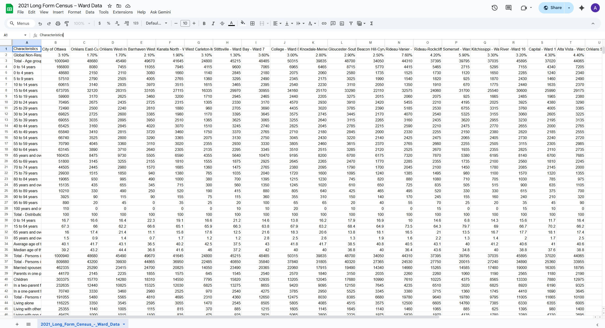
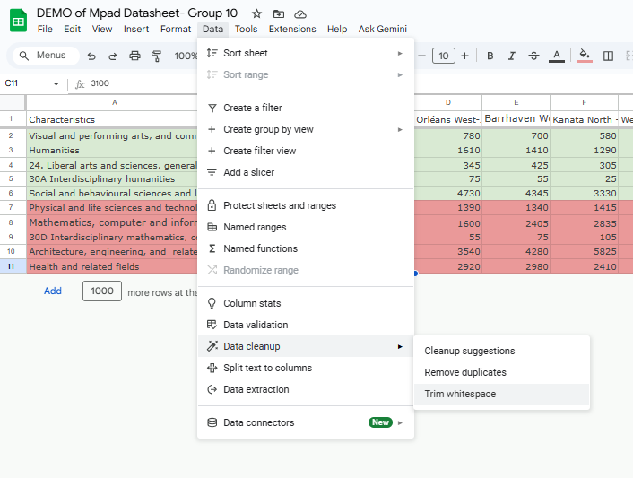
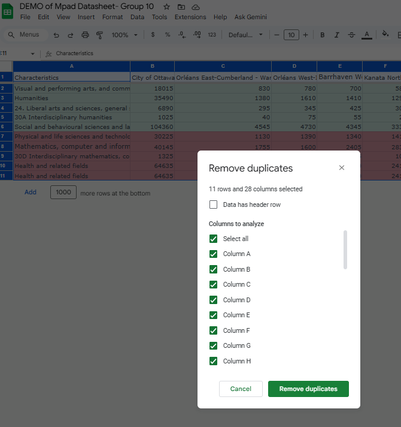
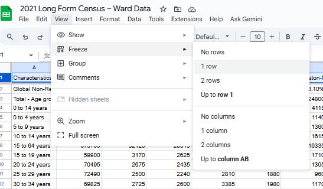
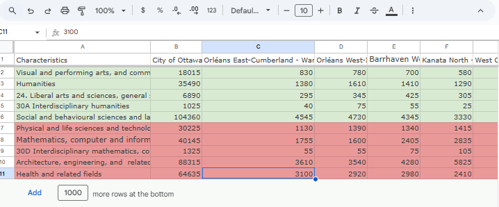
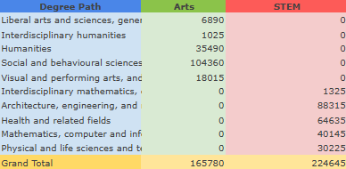
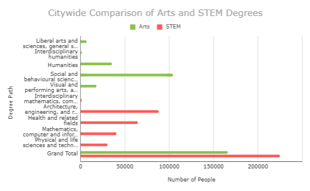

**Jean-Sébastien Marier**

**November 5, 2025**<br>
**MPAD2003A Introductory Data Storytelling (WKS) Fall 2025**<br>
**Amanda Kourtakos, Kennason Boudreault, Sean Halaby, Chimdalu Umeh**<br>
**Presented to Jean-Sébastien Marier**<br>


# Exploratory Data Analysis (EDA) & Pitch
## Ottawa’s Language Divide: How Geographic Location Influences Fields of Study

* [The template repository for this assignment in case you delete something by mistake](https://github.com/jsmarier/jou4100_jou4500_mpad2003_project2_template)

## 1. Introduction

The dataset presents the 2021 Canadian Census data for the city of Ottawa, organized by its 24 municipal wards. It includes a wide range of demographic and socio-economic variables such as age, gender distribution, family status, and education. For this analysis, our group is focusing on education, specifically comparing undergraduate degrees in STEM (science, technology, engineering, and mathematics) to those in Arts and Communications (humanities, social sciences, and media studies). We aim to explore how these two fields differ across Ottawa’s wards, as well as what these differences might reveal about local educational trends.

We used data from the City of Ottawa’s Open Data Portal, available here:

CVS file: <a href="https://raw.githubusercontent.com/jsmarier/files-for-course-assignments/refs/heads/main/2021_Long_Form_Census_-_Ward_Data.csv" target="_blank">CVS file of long-form census</a><br>

Original: <a href="https://open.ottawa.ca/datasets/ottawa::2021-long-form-census-ward-data/explore" target="_blank">Original long-form census link</a><br> 

The main sections of our report include: *Getting Data*, *Cleaning Data*, *Understanding Data (VIMO Analysis)*, *Exploratory Data Analysis*, *Potential Story*, and *Conclusion*.

## 2. Getting Data

We began by downloading a CSV copy of the 2021 Long Form Census – Ward Data from the Ottawa Open Data portal. To make it easier to analyze, we imported it into Google Sheets by selecting File → Import → Upload → Insert new sheet → Import data.

The dataset contained 2,602 rows and 26 columns, with each row representing a demographic indicator (e.g., total population, average income, or education level) and each column representing a geographic area (the city total plus 24 wards such as Kanata North, Stittsville, and Rideau-Rockcliffe).

At first glance, the dataset was extensive and required significant scrolling and filtering. Some column headers were long (e.g., “Total - Knowledge of official languages - English and French”), making them harder to interpret. While most data consisted of numerical counts and percentages, a few cells contained missing or zero values, possibly due to rounding or privacy restrictions. Despite this, the data is still credible and reliable, providing detailed information about Ottawa’s population.

<br>
*Figure 1: Screenshot of the raw dataset after importation.*

 Raw Google Sheet link: <a href="https://docs.google.com/spreadsheets/d/1Et5na0iqNPqnuylpLyU0DKL2hpSekxjYrOdPQDwxh68/edit?gid=256964509#gid=256964509" target="_blank">Original Google Sheet</a><br> 

### Specific Observations

- **Kanata North (Ward 4):** Leads in residents pursuing STEM fields (~25,220 individuals), aligning with its strong tech industry (Discover Technata, n.d.).  
- **Stittsville (Ward 6):** Shows 11,135 individuals pursuing STEM or technical studies, likely due to proximity to Kanata’s technology corridor (Ottawa Community Voice, n.d.).  
- **Somerset (Ward 14):** Features higher proportions of residents with university degrees, typical of downtown areas near universities and government offices (Statistics Canada, 2021).

### Hypothesis

We hypothesize that **where a person grows up in Ottawa influences their educational choices**. Specifically, western wards are expected to show higher STEM concentrations, while central wards lean toward Arts and Communications.


## 3. Understanding Data

### 3.1. VIMO Analysis

Before concluding our dataset, we conducted a VIMO (Valid, Invalid, Missing, Outlier) analysis to ensure that our findings were reliable and accurately represented Ottawa’s population. The dataset is based on the 2021 Census of Population, specifically the long-form census, which surveys about 25% of residents. Although it is a sample, it remains highly credible and representative of the city’s demographic and educational landscape.

**Valid Data:**
Valid data refers to whether the information accurately measures what it intends to. In this case, the dataset captures educational fields across Ottawa’s wards, focusing on STEM and Art degrees. Because the data comes from the long-form census, which provides detailed information on education levels and fields of study, it is a valid source for understanding how education varies geographically. For example, higher STEM concentrations in Kanata North align with that area’s population of professionals working in science and technology, confirming the data’s validity.

**Invalid Data:**
Invalid data involves possible misclassifications or interpretive errors. To reduce this, we established clear definitions: STEM fields include sciences, engineering, math, and technology, while Arts and Communications include humanities, visual arts, and social sciences. These consistent groupings helped prevent bias and ensured accurate comparisons between wards.

**Missing Data:**
Missing data was minimal, with only small gaps due to rounding or confidentiality. We treated blank or zero values as very low counts rather than absences, confirming that the dataset remained complete and consistent enough for analysis.

**Outliers:**
Outliers such as Kanata North’s high STEM rates or Somerset’s high Arts concentrations were not errors but reflections of real social and educational trends. These outliers helped reveal patterns showing how different communities create different types of learning and career interests.

**Conclusion:**
Together, this VIMO process confirmed that our dataset is credible and representative, allowing us to confidently explore our story: where you grow up can influence what you choose to study or pursue in life. The data showed that residents of Ottawa’s western wards (such as Kanata and Stittsville) are more likely to hold STEM degrees. In contrast, residents of central wards (such as Capital and Rideau-Vanier) are more likely to hold Arts and Communication degrees. This pattern reflects how community values, local schools, and neighborhood environments shape people’s educational and career paths, something we also recognized through our own personal experiences growing up in different areas of the city.


### 3.2. Cleaning Data

To begin preparing our dataset, we focused on cleaning the information to make it relevant and easy to interpret. Since our topic compared STEM and Arts degrees across Ottawa’s 24 wards, we started by reviewing the sheet carefully and keeping only the columns that were useful for our analysis. This also helped to focus on the data that directly matched our topic and made it easier to compare results between wards.

The first step in our cleaning process was to remove any unnecessary data that was not relevant to our project. Since there were extra spaces in the data, we used Google Sheets’ Trim Whitespace tool to eliminate extra spaces and ensure that all text was formatted consistently. 

Example:
<br>
*Figure 2: Screenshot of whitespace removal.*

Next, we removed any duplicates that might have appeared when we were copying data between sources. 

Example:
<br>
*Figure 3: Screenshot of duplicates removal.*

We also froze the first row to keep the column headers visible while scrolling through the dataset. This made it easier to navigate large amounts of data and stay organized while cleaning and analyzing it.

Example:
<br>
*Figure 4: Screenshot of freeze on row 1.*

After that, we quickly scanned the dataset to make sure that there were no blank cells or missing numbers that could affect our totals or averages. These steps helped ensure that our dataset was clean, consistent, and ready for analysis.

Once our data was fully cleaned, we could finally focus on understanding the data. We looked at how the numbers changed between wards and noticed that Kanata North showed higher numbers in STEM fields, while other wards leaned more toward the Arts.

<br>
*Figure 5: Screenshot of cleaned datasheet.*


### 3.3. Exploratory Data Analysis (EDA)

Once our data was fully cleaned, we focused on exploring patterns across Ottawa’s 24 wards. We created a pivot table in Google Sheets that listed the 24 wards as rows and degree type (STEM, Arts) as columns. This pivot table allowed us to compare the total number of people with STEM or Arts degrees side-by-side and quickly identify geographic trends.

**Pivot table setup (Google Sheets):**  
- **Rows:** Ward name  
- **Columns:** Degree type (STEM, Arts)  
- **Values:** SUM of individuals in each degree category (or COUNTA if counting non-empty entries)

Example of formulas used:
```=SUM(C2:C25)```
```=COUNTA(D2:D100)```

<br>
*Figure 6: Pivot table used for comparing STEM and Arts degrees across wards.*

We also made an exploratory bar chart with the Google Sheets Chart tool to visualize the citywide comparison between STEM and Arts totals. The bar chart was useful for clearly seeing absolute numbers and comparing totals across degree categories.


**Bar chart setup (Google Sheets):**  
1. Selected the pivot table results  
2. Clicked **Insert → Chart → Chart type: Bar chart**  
3. Used the Chart Editor to customize axis labels, chart title, and colors for clarity  

<br>
*Figure 7: Bar chart comparing total Arts and STEM degrees across degree categories in Ottawa.*

## 4. Potential Story

Insert text here.

## 5. Conclusion

Completing this data analysis project taught us that working with large public datasets is as much about storytelling as it is about numbers. At first, the most challenging part was understanding the dataset’s structure. With over two thousand rows, unclear headers, and repetitive variables, it was difficult to know where to begin. Cleaning and organizing the data required patience and precision, especially when trying to remember how to use functions like =TRIM() and narrowing down relevant information into pivot tables in Google Sheets

Despite these challenges, the most rewarding part was seeing patterns emerge that told a real story about Ottawa’s communities. Figuring out how geography can shape education and how Western wards lean toward STEM while downtown areas favor the Arts made the project feel relevant and meaningful. It showed us that data can reveal intriguing insights about how people live and learn. 

Through this process, we also recognized gaps in our own knowledge, especially in areas like data visualization, formula use, and critical interpretation. If we could redo the project, we would spend more time experimenting with charts and filters to create stronger visual evidence for our conclusions. Overall, this project helped us to appreciate how cleaned and analyzed data can form into a surprising narrative about the city we live in.


## 6. References

Include a list of your references here. Please follow [APA guidelines for references](https://apastyle.apa.org/style-grammar-guidelines/references). Hanging paragraphs aren't required though.

**Here's an example:**

Bounegru, L., & Gray, J. (Eds.). (2021). *The Data Journalism Handbook 2: Towards A Critical Data Practice*. Amsterdam University Press. [https://ocul-crl.primo.exlibrisgroup.com/permalink/01OCUL_CRL/hgdufh/alma991022890087305153](https://ocul-crl.primo.exlibrisgroup.com/permalink/01OCUL_CRL/hgdufh/alma991022890087305153)
